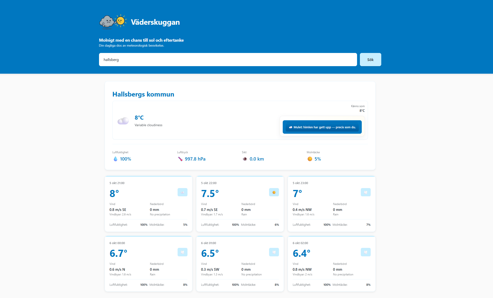
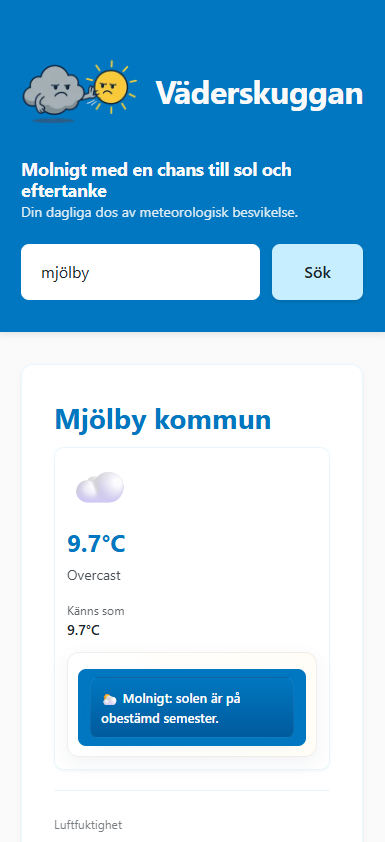

# Väderskuggan

<p align="center">
  
</p>

<p align="center">
  <strong>A modern Swedish weather application built with Next.js</strong>
</p>

<p align="center">
  <a href="#overview">Overview</a> •
  <a href="#features">Features</a> •
  <a href="#demo">Demo</a> •
  <a href="#getting-started">Getting Started</a> •
  <a href="#tech-stack">Tech Stack</a> •
  <a href="#project-structure">Project Structure</a> •
  <a href="#license">License</a>
</p>

---

## Overview

**Väderskuggan** is a clean and intuitive weather application that provides real-time and upcoming weather data for Swedish locations.  
Built with modern web technologies, it offers a seamless experience across desktop and mobile devices.

The application fetches weather data from **SMHI’s Open Data API** (Swedish Meteorological and Hydrological Institute) and presents it in a clear, accessible, and visually appealing interface.

---

## Features

- **Current Temperature Display** – Real-time temperature and conditions
- **Comprehensive Weather Metrics** – Humidity, air pressure, visibility, and cloud cover
- **Tomorrow’s Forecast** – Dedicated card for the next day’s weather
- **Responsive Design** – Optimized for both desktop and mobile devices
- **Interactive Comments** – Weather-related commentary and insights
- **High Performance** – Built with Next.js and Turbopack for optimal speed
- **Modern UI** – Clean and minimal design with Tailwind CSS
- **Optional Location Detection** – User‑initiated geolocation to instantly load local weather (privacy‑friendly; no position stored server-side)

---

## Demo

<div align="center">
  
  <br/>
  <em>Desktop View</em>
</div>

<div align="center">
  
  <br/>
  <em>Desktop View</em>
</div>

<br/>

<div align="center">
  
  <br/>
  <em>Mobile View</em>
</div>

---

## Getting Started

### Prerequisites

- **Node.js** (LTS version recommended)
- **npm** or **yarn**

### Installation

1. **Clone the repository**

   ```bash
   git clone https://github.com/knixan/vaderskuggan.git
   cd vaderskuggan
   ```

2. **Install dependencies**

   ```bash
   npm install
   ```

3. **Start the development server**

   ```bash
   npm run dev
   ```

4. **Open your browser**
   Visit `http://localhost:3000`

### Build for Production

```bash
npm run build
npm start
```

---

## Location & Privacy

The app supports an optional client‑side geolocation flow to quickly load weather for the user's current position.

### How it works

1. The user clicks “Dela min position” (Share my location).
2. The browser’s native permission prompt is shown (no custom overlay).
3. On success, the latitude and longitude are appended to the URL as a query parameter: `?location=LAT,LON`.
4. The server action (`getWeatherByLocation`) uses those coordinates to fetch weather.
5. A minimal local cache (`localStorage`) stores:

- `lastLocation` – last successful `lat,lng` pair
- `locationAsked` – whether the prompt has already been triggered in this browser
- `locationDenied` – whether the user previously denied access (to avoid re‑prompt loops)

### No server persistence

- Coordinates are never persisted in a database.
- Only the query string and localStorage (in the user’s browser) are used.
- Removing the query or clearing site data resets the state.

### Fallback Behavior

| Scenario                        | Result                                              |
| ------------------------------- | --------------------------------------------------- |
| First click + allow             | Weather loads for current coordinates               |
| Deny permission                 | Informational panel shown; user can search manually |
| Reload after allow              | Last coordinates auto‑applied (no new prompt)       |
| Reload after deny               | No re‑prompt; manual action required                |
| Missing / corrupt cached coords | Fresh geolocation attempt                           |

### Accessibility & UX Notes

- Uses a single clear button for user intent (no auto‑prompt on mere visit).
- Error messages are concise and semantic (`role="alert"`).
- Graceful degradation if `navigator.geolocation` is unavailable.

### Extending Location Logic

Ideas you can add:

- Reverse geocoding (e.g. Nominatim) to show human readable place name.
- Map links (open in OpenStreetMap / Google Maps).
- Dark mode adaptations for geolocation UI.
- Persist “banner dismissed” state (currently removed for minimalism).

---

---

## Tech Stack

- **Framework:** Next.js 15 with App Router
- **Language:** TypeScript
- **Styling:** Tailwind CSS 4
- **Icons:** React Icons
- **API:** SMHI Open Data API
- **Build Tool:** Turbopack

---

API: SMHI Open Data API

Build Tool: Turbopack

## Project Structure

```
vaderskuggan/
├── public/
│   ├── image/
│   │   └── loggo.png
│   ├── screenshot-desktop.png
│   └── screenshot-mobile.png
├── src/
│   ├── app/
│   │   ├── actions/
│   │   │   └── weather.ts          # Weather data fetching logic
│   │   ├── type/
│   │   │   └── types.ts            # TypeScript type definitions
│   │   ├── favicon.ico
│   │   ├── globals.css             # Global styles
│   │   ├── layout.tsx              # App layout component
│   │   └── page.tsx                # Main page component
│   └── components/
│       ├── comments.tsx            # Weather comment component
│       └── footer.tsx              # Footer component
├── eslint.config.mjs
├── next.config.ts
├── package.json
├── postcss.config.mjs
├── README.md
└── tsconfig.json
```

---

## Customization

- **Weather Logic:** Edit `src/app/actions/weather.ts` to adjust data fetching
- **Types:** Update `src/app/type/types.ts` for schema changes
- **Main Interface:** Modify `src/app/page.tsx` for layout updates
- **Comments:** Customize `src/components/comments.tsx` for comment handling

---

---

## API Information

This application uses SMHI's Open Data API to fetch weather information.
Refer to SMHI's documentation for details on:

- Endpoints and parameters
- Usage limitations and terms
- Attribution requirements

---

## License

This project was created by Josefine Eriksson.

### Attribution

- **Weather Data:** SMHI (Swedish Meteorological and Hydrological Institute)
- **Development Support:** Alexander, Lexicon Linköping
- **Design & Development:** Kod och Design

### Author

**Josefine Eriksson**

- Website: [kodochdesign.se](https://kodochdesign.se)
- GitHub: [@knixan](https://github.com/knixan)

<p align="center">
  Developed by <a href="https://kodochdesign.se">Kod och Design</a> in Sweden
</p> ```
